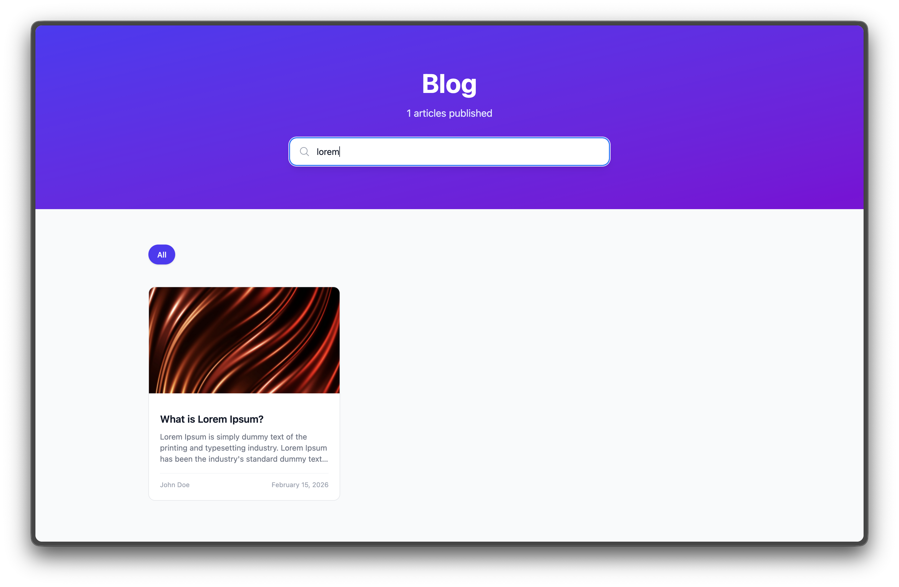
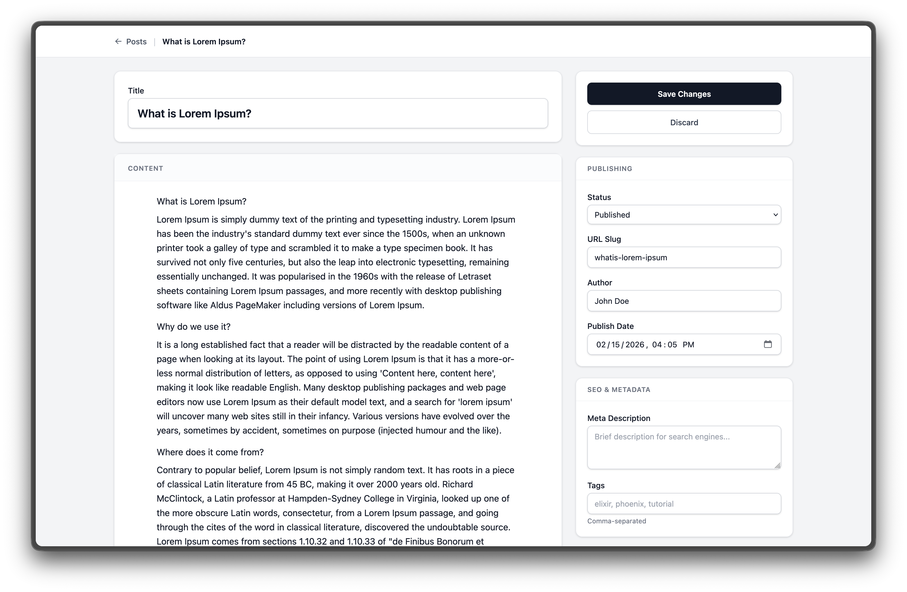
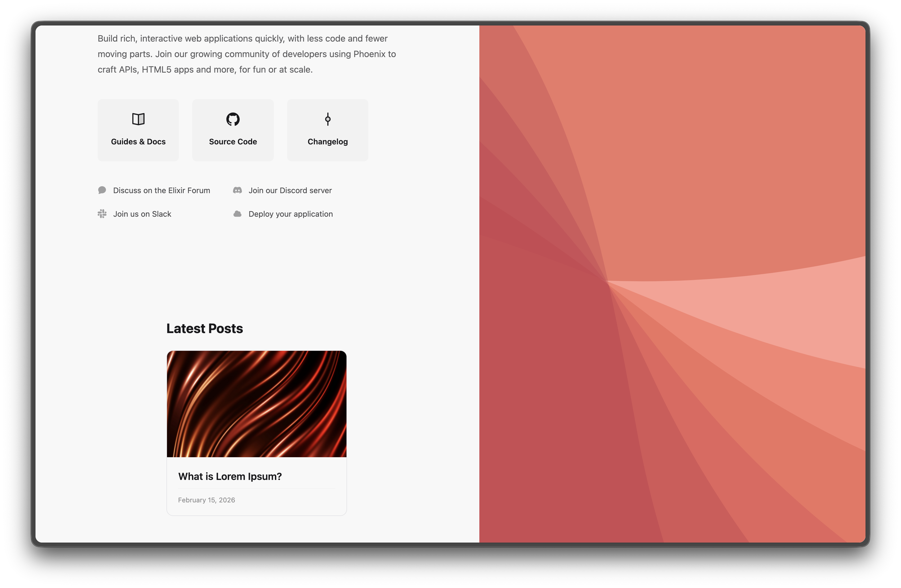

# PhoenixBlog



Plug-and-play blog engine for Phoenix with [Editor.js](https://editorjs.io/) integration.

- Public blog with search, tag filtering, and pagination
- Admin dashboard with Editor.js rich text editor
- Auto-save drafts — posts save automatically as you type
- SEO out of the box — Open Graph, Twitter Cards, canonical URLs, and JSON-LD structured data
- Embeddable recent posts component for any page
- Self-contained CSS and JS — loads its own assets automatically
- Supports PostgreSQL, MySQL, and SQLite
- Authentication via host app's `on_mount` hooks



## Installation

Add `phoenix_blog` to your list of dependencies in `mix.exs`:

```elixir
def deps do
  [
    {:phoenix_blog, "~> 0.1"}
  ]
end
```

## Setup

### 1. Configure the repo

```elixir
# config/config.exs
config :phoenix_blog, repo: MyApp.Repo
```

### 2. Create and run the migration

```bash
mix ecto.gen.migration add_phoenix_blog
```

```elixir
defmodule MyApp.Repo.Migrations.AddPhoenixBlog do
  use Ecto.Migration

  def up, do: PhoenixBlog.Migration.up()
  def down, do: PhoenixBlog.Migration.down()
end
```

```bash
mix ecto.migrate
```

### 3. Serve static assets

Add to your `endpoint.ex`, **before** the existing `Plug.Static`:

```elixir
plug Plug.Static,
  at: "/phoenix_blog",
  from: {:phoenix_blog, "priv/static"}
```

### 4. Register the JS hooks

In your `assets/js/app.js`:

```javascript
import { PhoenixBlogHooks } from "../../deps/phoenix_blog/priv/static/editorjs/hook.js"

const liveSocket = new LiveSocket("/live", Socket, {
  params: {_csrf_token: csrfToken},
  hooks: { ...PhoenixBlogHooks, ...yourOtherHooks }
})
```

Editor.js scripts are loaded dynamically by the hook — no additional `<script>` tags needed.

### 5. Add Tailwind source

Add the library's templates to your Tailwind source paths so its utility classes get generated. In `assets/css/app.css`:

```css
@source "../../deps/phoenix_blog/lib";
```

### 6. Mount routes

In your `router.ex`:

```elixir
use PhoenixBlog.Web, :router

# Public blog (accessible to everyone)
scope "/" do
  pipe_through :browser
  phoenix_blog "/blog"
end

# Admin dashboard (protected by your auth)
scope "/" do
  pipe_through [:browser, :require_authenticated_user]
  phoenix_blog_dashboard "/admin/blog",
    on_mount: [{MyAppWeb.UserAuth, :require_authenticated}]
end
```

That's it. The blog renders inside your app's root layout automatically.

### 7. Add SEO tags to your root layout

Add these two lines to the `<head>` in your root layout (`lib/my_app_web/components/layouts/root.html.heex`):

```heex
<PhoenixBlog.Web.SEO.meta_tags seo={assigns[:seo]} />
<PhoenixBlog.Web.SEO.json_ld seo={assigns[:seo]} />
```

These are no-ops on non-blog pages (when `@seo` is nil), so they're safe to include globally. On blog pages they automatically render Open Graph tags, Twitter Cards, canonical URLs, and JSON-LD structured data.

Alternatively, create a dedicated blog root layout (e.g. `blog_root.html.heex`) with the SEO tags included and pass it to the router:

```elixir
phoenix_blog "/blog", root_layout: {MyAppWeb.Layouts, :blog_root}
```

## SEO

Every blog page ships with complete SEO metadata — zero configuration required.

### What's rendered automatically

**Blog post pages** (`/blog/:slug`):
- `<title>` set to the post title
- `<meta name="description">` from the admin's SEO description field, or auto-generated from the first paragraph
- Open Graph tags: `og:title`, `og:description`, `og:image`, `og:url`, `og:type` (`article`), `og:site_name`, `og:locale`
- Article tags: `article:published_time`, `article:modified_time`, `article:author`, `article:tag`
- Twitter Card tags: `twitter:card` (`summary_large_image` when an image exists), `twitter:title`, `twitter:description`, `twitter:image`
- `<link rel="canonical">` with the clean URL (no query params)
- JSON-LD structured data (`Article` schema with headline, author, dates, publisher)

**Blog index page** (`/blog`):
- Open Graph tags with `og:type` set to `website`
- Twitter Card, canonical URL, and JSON-LD (`Blog` schema)

### Optional SEO configuration

All optional — sensible defaults are used if omitted:

```elixir
# config/config.exs
config :phoenix_blog,
  site_name: "My Blog",                          # default: "Blog"
  default_og_image: "https://example.com/og.png", # fallback when post has no featured image
  twitter_site: "@myhandle",                       # Twitter/X site handle
  locale: "en_US"                                  # Open Graph locale
```

## Usage

After setup, the built-in pages at `/blog` and `/admin/blog` are ready to use. You can also embed blog content into your own pages using the provided components.

### Embedding Recent Posts

Show the latest blog posts on any LiveView page:

```elixir
<.live_component
  module={PhoenixBlog.Web.Components.RecentPosts}
  id="recent-posts"
  blog_path="/blog"
/>
```



| Attribute | Default | Description |
|-----------|---------|-------------|
| `blog_path` | **(required)** | Path where your blog is mounted |
| `count` | `3` | Number of posts to display |
| `title` | `"Latest Posts"` | Section heading (`nil` to hide) |
| `class` | `nil` | Additional CSS classes on the wrapper |

### Embedding the Blog Feed

Use the `BlogFeed` component to add a full blog listing with search, tag filters, and pagination to any page — for example, a homepage:

```elixir
defmodule MyAppWeb.HomeLive do
  use MyAppWeb, :live_view

  alias PhoenixBlog.Web.Components.BlogFeed

  def mount(_params, _session, socket), do: {:ok, socket}

  def render(assigns) do
    ~H"""
    <Layouts.app flash={@flash}>
      <h1>Welcome to my site</h1>

      <.live_component
        module={BlogFeed}
        id="home-feed"
        blog_path="/blog"
        per_page={6}
        show_hero={false}
      />
    </Layouts.app>
    """
  end
end
```

Post cards link to `/blog/:slug` by default. The `blog_path` attribute must match the path you mounted `phoenix_blog` on in your router.

| Attribute | Default | Description |
|-----------|---------|-------------|
| `blog_path` | **(required)** | Path where your blog is mounted |
| `per_page` | `12` | Items per page |
| `show_search` | `true` | Show search bar |
| `show_tags` | `true` | Show tag filter buttons |
| `show_hero` | `false` | Show hero banner with title and post count |
| `class` | `nil` | Additional CSS classes for the wrapper |
| `grid_class` | `"grid grid-cols-1 sm:grid-cols-2 lg:grid-cols-3 gap-6"` | CSS classes for the posts grid |

#### Custom post cards with slots

Override the default card design using the `:post_card` slot. This is useful when your app uses a design system (e.g. daisyUI) and you want the blog feed to match:

```elixir
<.live_component module={BlogFeed} id="home-feed" blog_path="/blog">
  <:post_card :let={post}>
    <a href={"/blog/#{post.slug}"} class="card bg-base-100 border hover:shadow-lg transition-all">
      <figure :if={post.featured_image_url} class="h-48">
        
      </figure>
      <div class="card-body p-5">
        <h2 class="card-title text-lg">{post.title}</h2>
        <p :if={post.author} class="text-sm opacity-50">{post.author}</p>
      </div>
    </a>
  </:post_card>

  <:empty>
    <p class="text-center py-12">Nothing here yet!</p>
  </:empty>
</.live_component>
```

The post struct passed to `:let` contains: `title`, `slug`, `body`, `tags`, `author`, `featured_image_url`, `published_at`, `seo_description`.

### Custom Blog Post View

To build your own post page (e.g. with a sidebar or related posts), use the `:show_view` router option and the `BlogPost` component:

```elixir
# router.ex
phoenix_blog "/blog", show_view: MyAppWeb.CustomBlogShow
```

```elixir
defmodule MyAppWeb.CustomBlogShow do
  use MyAppWeb, :live_view

  import PhoenixBlog.Web.Components.BlogPost

  def mount(_params, _session, socket), do: {:ok, socket}

  def handle_params(%{"slug" => slug}, uri, socket) do
    post = PhoenixBlog.get_post_by_slug!(slug)

    {:noreply,
     socket
     |> assign(:post, post)
     |> assign(:page_title, post.title)
     |> PhoenixBlog.Web.SEO.assign_seo(post, uri)}
  end

  def render(assigns) do
    ~H"""
    <div class="max-w-4xl mx-auto px-4 py-12">
      <.blog_post post={@post} blog_path="/blog" show_tags_footer={false} />

      <aside class="mt-12">
        <.live_component
          module={PhoenixBlog.Web.Components.RecentPosts}
          id="related-posts"
          blog_path="/blog"
          title="More articles"
          count={3}
        />
      </aside>
    </div>
    """
  end
end
```

Call `PhoenixBlog.Web.SEO.assign_seo/3` in your `handle_params` to get full SEO metadata on custom views.

| Attribute | Default | Description |
|-----------|---------|-------------|
| `post` | **(required)** | A `%PhoenixBlog.Post{}` struct |
| `blog_path` | `"/blog"` | Path for back and tag links |
| `show_back_link` | `true` | Show "Back to blog" link |
| `show_header` | `true` | Show title, tags, author, and date |
| `show_featured_image` | `true` | Show the featured image |
| `show_tags_footer` | `true` | Show tags section at the bottom |
| `class` | `nil` | CSS classes for the wrapper `<article>` element |

### Rendering Editor.js Content

Use `render_editor_blocks/1` to render post content anywhere:

```elixir
import PhoenixBlog.Web.BlogComponents

<.render_editor_blocks blocks={Map.get(@post.body, "blocks", [])} />
```

Supported block types: **paragraph**, **header** (h1-h6), **list** (ordered/unordered), **quote** (with caption), **code**, **table**, **delimiter**, **embed** (YouTube, Twitter, Vimeo), and **image** (with caption).

### Excerpt Extraction

Extract a plain-text excerpt from any post's Editor.js body:

```elixir
import PhoenixBlog.Web.BlogComponents

extract_excerpt(post)       # 150 chars (default)
extract_excerpt(post, 100)  # custom length
```

Returns the first paragraph's text, stripped of HTML tags and truncated with `...`.

## Configuration

| Option | Default | Description |
|--------|---------|-------------|
| `:repo` | **(required)** | Your Ecto repo module |
| `:table_name` | `"phoenix_blog_posts"` | Database table name |
| `:site_name` | `"Blog"` | Site name for Open Graph and JSON-LD |
| `:default_og_image` | `nil` | Fallback OG image URL when post has no featured image |
| `:twitter_site` | `nil` | Twitter/X site handle (e.g. `"@myhandle"`) |
| `:locale` | `"en_US"` | Open Graph locale |

## Router Options

### `phoenix_blog/2`

| Option | Default | Description |
|--------|---------|-------------|
| `:on_mount` | `[]` | Additional `on_mount` hooks |
| `:as` | `:phoenix_blog` | Live session name |
| `:layout` | `nil` | Custom app layout `{Module, :template}` |
| `:root_layout` | `nil` | Override root layout (e.g. a dedicated `blog_root` layout) |
| `:index_view` | `PhoenixBlog.Web.Live.Public.Index` | Custom LiveView for the blog index |
| `:show_view` | `PhoenixBlog.Web.Live.Public.Show` | Custom LiveView for the blog post page |

### `phoenix_blog_dashboard/2`

| Option | Default | Description |
|--------|---------|-------------|
| `:on_mount` | `[]` | Authentication hooks (recommended) |
| `:as` | `:phoenix_blog_dashboard` | Live session name |
| `:layout` | `nil` | Custom app layout `{Module, :template}` |

## Features

### Public Blog (`/blog`)

- Responsive card grid with featured images
- Full-text search
- Tag filtering
- Pagination
- SEO-friendly slugs
- Full SEO metadata (Open Graph, Twitter Cards, JSON-LD, canonical URLs)

### Admin Dashboard (`/admin/blog`)

- Post list with search, status filter, and pagination
- Editor.js rich text editor with auto-save
- Draft/Published/Archived status management
- SEO metadata (description, slug, tags)
- Featured image support (via URL)
- Soft delete and restore

### Editor.js Tools

The following tools are included out of the box:

- **Header** (h1-h6)
- **List** (ordered/unordered)
- **Quote** (with caption)
- **Code** (code blocks)
- **Table** (rows/cols)
- **Delimiter** (section break)
- **Embed** (YouTube, Twitter, Vimeo, Instagram, CodePen)
- **Image** (via URL)

## Public API

The `PhoenixBlog` module exposes functions for querying posts from your own code:

```elixir
# Latest published posts (for widgets, feeds, etc.)
PhoenixBlog.list_latest_published_posts(5)

# Paginated published posts with filters
PhoenixBlog.list_published_posts(page: 1, per_page: 10, tag: "elixir")

# Single post by slug
PhoenixBlog.get_post_by_slug!("my-post")

# Admin CRUD
PhoenixBlog.create_post(%{"title" => "Hello", "status" => "draft", ...})
PhoenixBlog.update_post(post, %{"status" => "published"})
PhoenixBlog.publish_post(post)
PhoenixBlog.soft_delete_post(post)
PhoenixBlog.restore_post(post)
```
